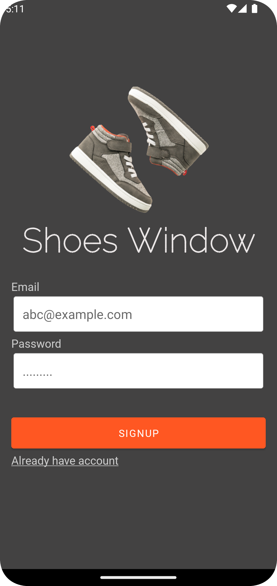
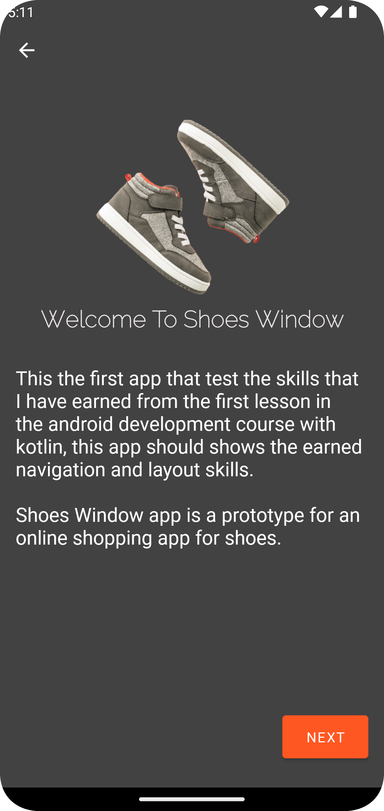
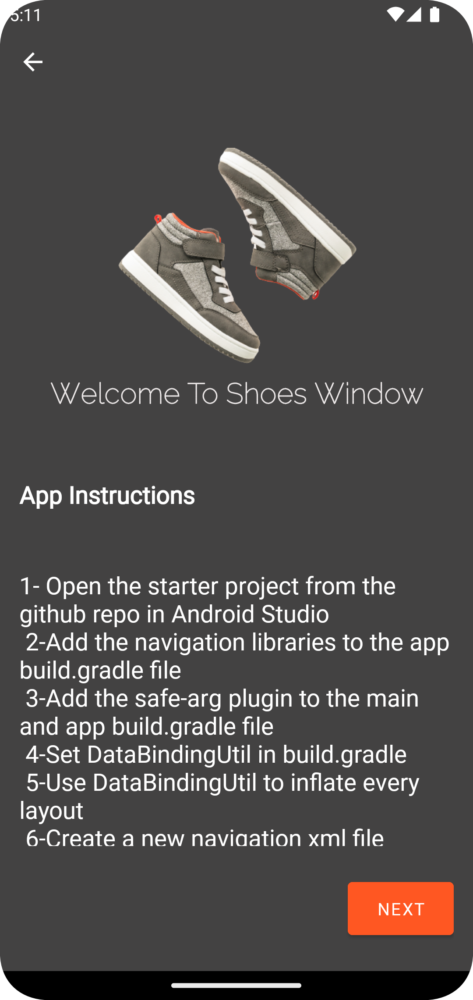
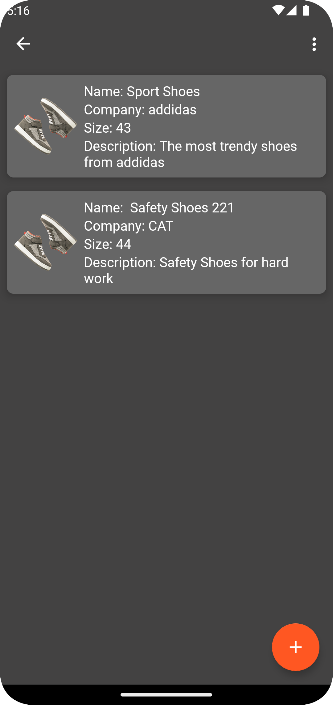
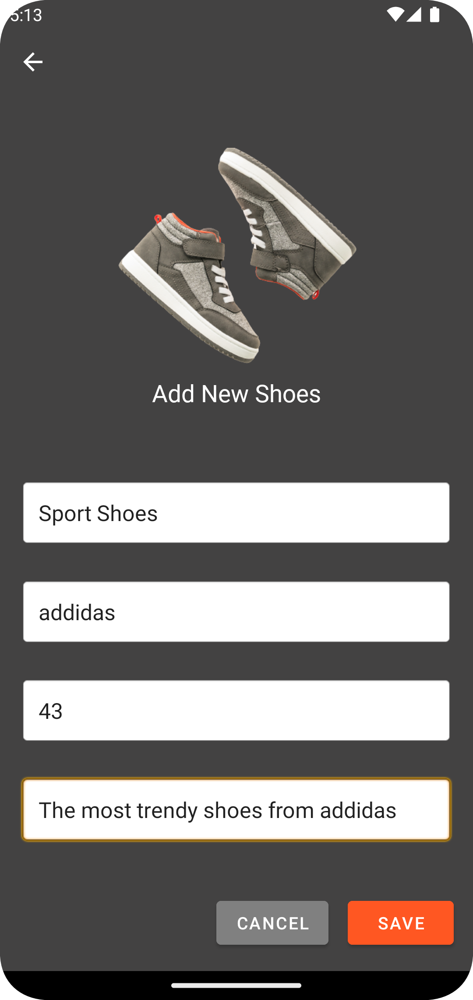

# shoesWindow
### Online shopping android app for shoes, has been written in Kotlin 

* Android Constraint Layout
* Android Navigation Component
* DataBinding
* ViewModel & LiveData

  
  
  

  
  

## Getting Started

This project is a starting point for a Android application Development.

A few resources to get you started:

- [Android Documentation](https://developer.android.com/docs)
- [Android Jetpack](https://developer.android.com/jetpack?gclid=CjwKCAjwtKmaBhBMEiwAyINuwLwczCSIvTy5CHI8ISBbH0yS5nYBO1lGKSBI6Vh9Os4B4M0OAUyiaRoCIYwQAvD_BwE&gclsrc=aw.ds)

